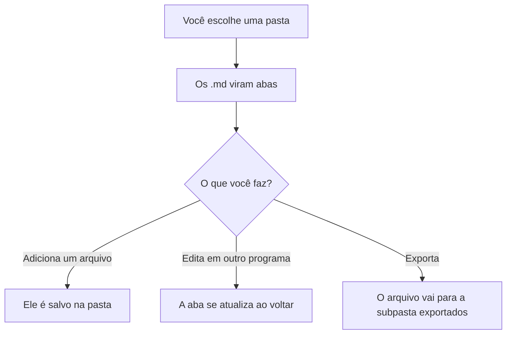
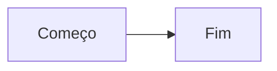

# Como usar o Leia-me

Este é um guia de exemplo, um arquivo Markdown como outro qualquer. Leia, exporte ou feche à vontade.

## Em um minuto

1. Arraste um ou mais arquivos `.md` para a página, ou clique em **Abrir arquivos**.
2. Cada arquivo vira uma **aba**.
3. Blocos de código `mermaid` são desenhados como **diagramas**.
4. Baixe os diagramas, ou o documento inteiro, em **SVG, PNG ou PDF**.

## Abrir arquivos

| Como | O que acontece |
| --- | --- |
| Arrastar para a página | Abre todos os arquivos soltos, um por aba |
| Abrir arquivos | Faz o mesmo, escolhendo no seletor do computador |
| Colar Markdown | Abre um texto colado e deixa você dar um nome ao arquivo |

São aceitos arquivos `.md`, `.markdown` e `.txt`. Ao abrir de novo um arquivo com o mesmo nome, a aba é atualizada.

## Abas

- Clique numa aba para ler aquele arquivo. Com o teclado, use as setas, **Home** e **End**.
- Cada aba lembra até onde você leu.
- O **×** remove o arquivo da pasta guardada no navegador. Logo depois aparece um aviso com **Desfazer**.

## Painel lateral

- **Neste documento**: os títulos do arquivo, para pular direto a uma parte.
- **Diagramas**: a lista de diagramas do arquivo.
- **Exportação**: baixa o documento em PDF ou PNG, define o tamanho do PNG e o fundo transparente, e reúne todos os diagramas num `.zip`.
- **Pasta de arquivos**: escolhe, atualiza ou troca a pasta (veja a seção abaixo).

Em telas pequenas, o painel fica recolhido em **Painel do documento**, logo acima do texto.

## Escolher uma pasta no computador

Disponível no Chrome, no Edge e no Opera. No Firefox e no Safari os arquivos ficam guardados no navegador.

1. Clique em **Escolher pasta**.
2. Permita que a página edite a pasta.
3. Os arquivos `.md` dela viram abas.



Com a pasta conectada:

- Arquivos novos são **salvos na pasta**. Se já existir um com o mesmo nome e conteúdo diferente, o novo ganha um número, como `nome 2.md`. Nada é sobrescrito.
- As exportações vão para a subpasta **exportados**. Desmarque **Salvar na pasta escolhida** para baixar pelo navegador.
- O **×** das abas some, para ninguém apagar um arquivo sem querer. Para apagar, use **Apagar da pasta…** no painel lateral.
- Na próxima visita, o navegador pode pedir permissão de novo. Clique em **Reconectar à pasta**.
- **Desconectar a pasta** não apaga nada no computador.

## Diagramas

Escreva o diagrama num bloco de código com a linguagem `mermaid`:

````text

````

Cada diagrama desenhado tem uma barra com estes botões:

| Botão | O que faz |
| --- | --- |
| Ampliar | Abre o desenho em tela grande |
| Baixar SVG | Imagem vetorial, boa para editar e ampliar sem perder qualidade |
| Baixar PNG | Imagem comum, em 1x, 2x ou 3x de tamanho |
| Baixar PDF | Uma página do tamanho do desenho |

Se um diagrama tiver erro de sintaxe, só ele é marcado, com a mensagem do erro. O resto do arquivo continua legível.

## Exportar o documento inteiro

- **Documento em PDF**: páginas A4 numeradas, com quebras que evitam cortar tabelas e diagramas.
- **Documento em PNG**: uma imagem única de toda a leitura.
- O resultado sai sempre no tema claro, mesmo que a página esteja no modo escuro.

## Limites e dicas

- Imagens só aparecem se estiverem embutidas no próprio arquivo. Links para imagens externas ou relativas são avisados e não carregam.
- Arquivos acima de 5 MB são ignorados ao ler uma pasta.
- Só os arquivos da pasta principal são lidos, não os das subpastas.
- O PDF é feito de imagens: o texto não pode ser selecionado.
- Este guia é só um exemplo. Feche a aba quando não precisar mais dele.
