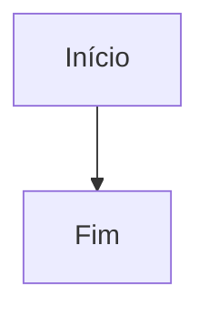

# Guia de uso do Leia-me

O Leia-me é um leitor e organizador de documentos Markdown. Com ele, você pode abrir ou criar arquivos `.md`, ler e editar o conteúdo, comparar alterações, organizar documentos em pastas e exportar documentos e diagramas.

## Começar

1. Clique em **Abrir arquivos** ou arraste arquivos para a página.
2. Cada documento aparece em uma aba. Selecione a aba para alternar entre documentos.
3. Clique em **Novo .md** para criar um arquivo. Ele começa com o título `# Novo documento` e abre no editor.
4. Clique em **Markdown** para pesquisar comandos e exemplos da sintaxe.

O Leia-me aceita `.md`, `.markdown`, `.mdown` e `.txt`. Você pode abrir vários arquivos de uma vez. Se já houver um arquivo com o mesmo nome, o novo recebe um número — por exemplo, `anotacoes (2).md` — para evitar substituir o existente.

## Abrir e criar documentos

- **Abrir arquivos** abre documentos selecionados no computador.
- **+ Adicionar** abre mais arquivos nas abas atuais.
- Também é possível arrastar arquivos para a página.
- **Colar Markdown** cria um documento a partir de texto colado e permite informar o nome do arquivo.
- **Novo .md** cria um documento com o título inicial e abre o editor para você continuar escrevendo.

## Editar, renomear e apagar

Selecione um documento e use o painel lateral:

- **Editar documento** abre o texto Markdown e uma comparação com o original. As linhas adicionadas e removidas ficam destacadas. **Salvar alterações** grava o texto.
- **Renomear arquivo** altera o nome. Nomes existentes não são substituídos; o Leia-me acrescenta um número quando necessário.
- **Apagar da pasta** remove o arquivo do computador se uma pasta estiver conectada. Logo após apagar, use **Desfazer** para restaurá-lo.

Sem uma pasta do computador conectada, os documentos são guardados no navegador. Nesse modo, o botão **×** remove uma aba e também oferece **Desfazer**.

## Organizar em pastas

A barra **Pastas** permite criar grupos com **+ Criar pasta**. Use os ícones junto a cada grupo para renomeá-lo ou excluí-lo. Os filtros **Todos** e **Sem pasta** ajudam a encontrar documentos.

Para mover um documento, abra-o e escolha uma opção em **Organizar em pasta**, no painel lateral. Um documento criado enquanto um grupo está selecionado é adicionado a esse grupo.

Quando uma pasta do computador está conectada, os grupos também são subpastas reais dentro dela. Mover um documento no site move o arquivo no computador. Renomear um grupo atualiza o nome da pasta e dos documentos organizados nela. Ao excluir um grupo, os documentos vão para a pasta principal; arquivos que não são gerenciados pelo Leia-me podem fazer a pasta antiga permanecer.

## Usar uma pasta do computador

Sem conectar uma pasta, os documentos ficam armazenados no navegador. Para trabalhar com arquivos diretamente no computador, escolha **Escolher pasta** no painel **Pasta de arquivos** e conceda permissão ao navegador.

Com a pasta conectada:

- Os arquivos `.md`, `.markdown`, `.mdown` e `.txt` da pasta principal e dos grupos aparecem nas abas.
- Criar, editar, renomear e mover documentos pelo site atualiza os arquivos no computador.
- **Atualizar a pasta** lê novamente o conteúdo para refletir alterações feitas fora do site.
- Se a permissão expirar, clique em **Reconectar à pasta**.
- **Desconectar a pasta** encerra o acesso do site, mas não apaga os arquivos do computador.

A escolha de pastas depende do suporte do navegador e pode exigir que o site seja aberto em HTTPS ou em `localhost`. Chrome e Edge são recomendados. Se a seleção de pastas não estiver disponível, você ainda pode abrir arquivos e guardá-los no navegador.

## Leitura e recursos Markdown

O documento é exibido como uma página formatada. O painel lateral lista títulos e diagramas para facilitar a navegação. Em telas estreitas, abra ou recolha o painel tocando em **Painel do documento**.

Clique em **Markdown** para abrir a referência pesquisável. Ela reúne exemplos copiáveis de títulos (`#` até `######`), parágrafos, negrito, itálico, listas, listas de tarefas, citações, links, imagens, tabelas, código, HTML e outros recursos.

O atalho para abrir ou fechar a referência é **Ctrl+Alt+M**. **Ctrl+Shift+O** não é usado pelo site porque abre os favoritos em navegadores como Chrome e Edge.

### Diagramas Mermaid

Coloque o código do diagrama em um bloco identificado como `mermaid`:

````markdown

````

O diagrama renderizado oferece **Ampliar**, **Baixar SVG**, **Baixar PNG** e **Baixar PDF**. Se o documento tiver dois ou mais diagramas, o painel permite baixar todos em um `.zip` com versões SVG e PNG. As opções de escala do PNG e fundo transparente também ficam no painel de exportação.

### Imagens

O leitor exibe imagens embutidas no próprio documento. Imagens referenciadas por endereços externos ou caminhos relativos não são carregadas.

## Exportar documentos

No painel **Exportação**:

- **Documento em PDF** gera páginas A4 numeradas.
- **Documento em PNG** gera uma imagem do documento inteiro. Escolha a resolução normal, nítida ou alta.
- Com uma pasta conectada, marque **Salvar na pasta escolhida** para gravar exportações na subpasta `exportados`. Desmarque a opção para baixar pelo navegador.

**Baixar todos (.zip)** reúne os diagramas do documento atual quando há dois ou mais. **Baixar a pasta (.zip)** reúne os documentos abertos e preserva a estrutura dos grupos.

## Observações

- Ao ler uma pasta, arquivos ocultos e arquivos com mais de 5 MB são ignorados.
- O guia interno **Como usar o site** fica em uma aba separada e não pode ser removido.
- Quando o site é servido por HTTP ou HTTPS, o `README.md` da raiz do projeto pode ser carregado automaticamente como documento.
- Bibliotecas de leitura e exportação são carregadas pela internet; a conexão é necessária para esses recursos.
