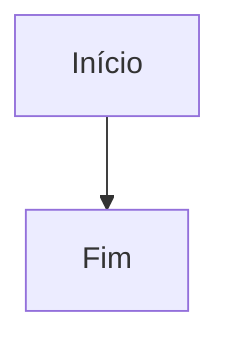

# Guia completo do Leia-me

O Leia-me é um leitor e organizador de documentos Markdown. Você pode abrir arquivos existentes, criar e editar documentos, acompanhar as alterações em uma comparação visual, organizar arquivos em grupos e exportar documentos ou diagramas.

## Início rápido

1. Clique em **Abrir arquivos** ou arraste arquivos para a página.
2. Abra **Novo .md** para começar um documento novo. Ele recebe o título `# Novo documento` e abre no editor.
3. Cada arquivo aberto aparece em uma aba. Selecione uma aba para alternar entre documentos.
4. Clique em **Markdown** para consultar os comandos e pesquisar exemplos.

São aceitos arquivos `.md`, `.markdown`, `.mdown` e `.txt`. Você pode abrir vários arquivos juntos. O Leia-me não substitui um arquivo de mesmo nome: cria uma cópia numerada, como `anotacoes (2).md`, `anotacoes (3).md` e assim por diante.

## Criar, abrir e adicionar arquivos

- **Novo .md** cria um arquivo Markdown com o título inicial e abre o editor.
- **Abrir arquivos** seleciona um ou mais arquivos no computador.
- **+ Adicionar** inclui arquivos em uma sessão que já está aberta.
- Arrastar arquivos para a página também os abre como abas.
- **Colar Markdown** abre uma janela para colar texto e escolher o nome do documento.

O conteúdo fica salvo no armazenamento do navegador enquanto você não conecta uma pasta do computador. As abas de documentos comuns podem ser removidas com **×**; a opção **Desfazer** aparece logo depois. O guia interno **Como usar o site** fica em uma aba separada e protegida.

## Editar, comparar, renomear e apagar

Com um documento selecionado, use as opções do painel lateral:

- **Editar documento** abre o texto Markdown e a comparação com o original. Linhas incluídas e removidas ficam destacadas enquanto você escreve. **Salvar alterações** grava a nova versão.
- Se o arquivo mudar depois que o editor for aberto, o Leia-me avisa para você reabrir e comparar com a versão mais recente.
- **Renomear arquivo** altera o nome e conserva o conteúdo. Caso já exista um arquivo com o nome escolhido, o Leia-me usa o próximo número disponível.
- **Apagar da pasta** remove o arquivo da pasta conectada no computador. A notificação oferece **Desfazer** para restaurá-lo.

Sem pasta conectada, os documentos são mantidos no navegador e o **×** remove a aba da lista local.

## Organizar documentos em pastas

A barra **Pastas** mostra os filtros **Todos** e **Sem pasta**, além dos grupos criados pelo usuário.

1. Clique em **+ Criar pasta** e informe um nome.
2. Selecione um documento e escolha o grupo em **Organizar em pasta**, no painel lateral.
3. Para ver somente os documentos de um grupo, selecione o filtro dele.
4. Use os controles ao lado de um grupo para renomeá-lo ou excluí-lo.

Documentos novos são colocados no grupo que estiver selecionado. Se não houver uma pasta do computador conectada, os grupos organizam os documentos no armazenamento local do navegador.

Com uma pasta do computador conectada, cada grupo é uma subpasta real. Criar, renomear e excluir grupos e mover documentos atualiza a organização no disco. Ao excluir um grupo, os documentos que ele contém vão para a pasta principal. A pasta antiga só é removida se estiver vazia; outros arquivos dentro dela são preservados.

## Conectar uma pasta do computador

No painel **Pasta de arquivos**, clique em **Escolher pasta no computador** e permita o acesso. Chrome e Edge são recomendados; a seleção de diretórios pode exigir HTTPS ou `localhost`.

Depois de conectar:

- Os arquivos `.md`, `.markdown`, `.mdown` e `.txt` da pasta principal e dos grupos conhecidos aparecem como abas.
- Novos documentos são gravados no diretório correspondente. Edições, renomeações e movimentos também são aplicados aos arquivos no computador.
- **Atualizar a pasta** compara o conteúdo do disco com as abas e atualiza a visualização. O site também tenta sincronizar quando a página volta a ficar visível.
- Se o navegador solicitar autorização novamente, clique em **Reconectar à pasta**.
- **Trocar de pasta** seleciona outro diretório. **Desconectar a pasta** encerra o acesso do site e mantém os arquivos no computador.

Pastas de grupos criadas antes de conectar o computador são materializadas como subpastas quando a pasta é conectada. Arquivos ocultos e arquivos com mais de 5 MB são ignorados ao ler o diretório. O Leia-me acompanha a pasta conectada e as subpastas de grupos que ele conhece.

## Leitura e recursos Markdown

O Leia-me transforma o texto Markdown em uma página formatada. O painel lateral **Neste documento** lista os títulos até o terceiro nível e permite pular para cada seção. Em telas estreitas, toque em **Painel do documento** para recolher ou abrir o painel.

A janela **Markdown** contém uma busca e exemplos copiáveis de títulos (`#` até `######`), parágrafos, quebras de linha, negrito, itálico, tachado, citações, listas ordenadas e não ordenadas, listas de tarefas, código em linha, blocos de código, tabelas, links, imagens, caracteres escapados e HTML.

- Clique em **Markdown** ou pressione **Ctrl+Alt+M** para abrir ou fechar a referência.
- `Ctrl+Shift+O` não é usado pelo site: nos navegadores comuns ele já abre favoritos ou o gerenciador de favoritos.
- Links externos são abertos em outra aba.
- Imagens precisam estar embutidas no documento. Imagens externas ou caminhos relativos não são exibidos.
- O HTML é sanitizado antes de ser mostrado.

## Diagramas Mermaid

Um bloco de código com a linguagem `mermaid` vira um diagrama:

````markdown

````

O site renderiza tipos de diagrama Mermaid como fluxogramas, diagramas de sequência, estados, classes, entidades, Gantt, pizza, mapas mentais, linhas do tempo e outros. Se houver erro de sintaxe, o Leia-me mostra o aviso no lugar daquele desenho; o restante do documento continua disponível.

Cada diagrama tem os controles **Ampliar**, **Baixar SVG**, **Baixar PNG** e **Baixar PDF**. No painel **Diagramas**, selecione um diagrama para ir até ele. Quando o documento tem pelo menos dois diagramas, **Baixar todos (.zip)** cria um pacote SVG e PNG para cada um. A escala do PNG pode ser normal (1x), nítida (2x) ou alta resolução (3x), e é possível habilitar fundo transparente.

## Exportar documentos e grupos

No painel **Exportação**:

- **Documento em PDF** gera páginas A4 numeradas.
- **Documento em PNG** gera uma imagem do documento inteiro; escolha a escala antes de exportar.
- **Salvar na pasta escolhida** grava as exportações na subpasta `exportados` do diretório conectado. Desmarque para baixar pelo navegador.

No painel **Pasta de arquivos**, **Baixar a pasta (.zip)** reúne os documentos abertos e mantém a estrutura das subpastas de grupos. Quando o guia interno é apenas uma aba virtual da pasta conectada, ele não corresponde a um arquivo nessa pasta.

## Carregamento automático do README

Quando a página é aberta por HTTP ou HTTPS e não há uma pasta do computador conectada, o Leia-me tenta carregar `README.md` da raiz do projeto como um documento. Ao abrir a página diretamente como arquivo local (`file://`), use **Abrir arquivos** ou arraste o README para a página.

## Aparência e requisitos

O site adapta o tema claro ou escuro à preferência de aparência do navegador/sistema. A interface também se ajusta a telas menores, com painel recolhível e barras de abas e pastas que podem ser roladas horizontalmente.

As bibliotecas de leitura, diagramas e exportação são carregadas pela internet. Para usar todos esses recursos, mantenha uma conexão disponível.
